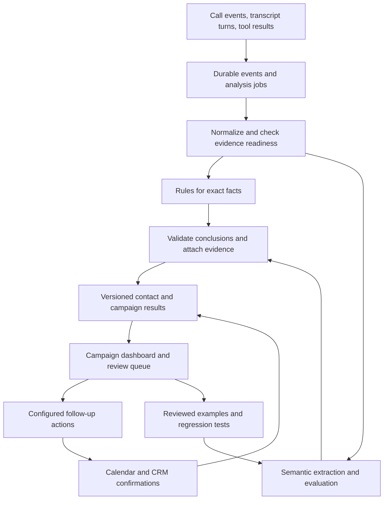

**Vozon: product and system strategy for call analysis**

Prepared 19 September 2026. Proposed design; targets below are release criteria, not measured performance. Based on the current repository and public first-party documentation. Competitive research establishes available features, not independently measured quality or the absence of undocumented capabilities.

**1. The product decision**

Build analysis that connects what people said, what the agent did, what actually happened in the business, and what the operator should do next.

Customer promise: “After 1,000 calls, understand the results, see the evidence, and resolve the next actions from one screen.”

Win on four measurable dimensions: outcome accuracy, verified conversions, operator time, and cost per verified outcome. A feature count or a self-reported AI score cannot establish market leadership.

Start with appointment and lead qualification campaigns. This is a proposed initial segment because Vozon already has Calendar, Calendly, DigitalBot, HubSpot, campaign leads, recordings, and structured extraction. Validate demand with five campaign operators before treating this segment as the long-term market. Deliver reusable outcome definitions so later segments can use the same engine.

The first product should make these decisions easy:

- Which contacts produced a confirmed result?
- Which contacts need a callback, booking recovery, or a human decision?
- What evidence supports the result?
- Which recurring problems deserve an agent or integration fix?
- Did those fixes and follow-ups improve the final business result?

**2. Competitive baseline and the opportunity**

| Platform | Publicly documented capabilities | Consequence for Vozon |
| --- | --- | --- |
| Vapi | Campaign contact results, structured outputs, KPI scorecards | Summaries, filters, and scores are expected functionality. [Campaigns](https://docs.vapi.ai/outbound-campaigns/overview), [scorecards](https://docs.vapi.ai/observability/scorecard-quickstart). |
| Retell | Custom dashboards, two-way CRM sync, live monitoring, and native workflows | Integration and automation alone are insufficient differentiation. [June release](https://www.retellai.com/changelog/live-call-monitoring-custom-dashboards-built-in-crm-colloquial-model-expressive-mode), [August workflows release](https://www.retellai.com/changelog/retell-workflows-brex-top-25-and-more). |
| ElevenLabs | Success/failure/unknown evaluations with rationale and analytics across agents, versions, and languages | Configurable evaluation and experiment comparison are also established. [Evaluation](https://elevenlabs.io/docs/eleven-agents/customization/agent-analysis/success-evaluation), [analytics](https://elevenlabs.io/docs/eleven-agents/dashboard). |
| Hamming | Evidence validation and production call QA guidance | Evidence and review workflows have existing competitors too. [Structured output validation](https://hamming.ai/resources/voice-agent-structured-output-validation-checklist). |

The proposed advantage is the complete experience for a specific customer: accurate multilingual analysis, business-system confirmation, contact history across attempts, and measurable recovery of missed opportunities. This combination must outperform alternatives in customer trials. It is not a claim that every component is novel.

**3. Fix the foundation before relying on new dashboards**

The code review found specific limitations in `backend/src/services/callIntelligenceService.ts`:

- The fallback outcome matcher checks positive words before rejection and failure. An isolated execution of the actual function returned `qualified` for “I am not interested,” “Do not call me about this appointment,” and “The booking failed.” This verifies a classifier defect, not that any live customer record has been affected.
- AI extraction is conditional on configuration. Fallback extraction is also marked `completed`, without exposing its source or evidential quality.
- The model input retains only the first 30,000 transcript characters. Long calls can lose their final agreement or correction.
- Analysis reads the agent's current analysis plan during finalization. It does not snapshot the plan used for that call in this path.
- Existing structured output values override newly extracted values without field-level provenance in that merge.
- Intelligence processing precedes billing and staged integrations in `backend/src/services/callRecordService.ts`. Two sequential AI requests each have a 30-second timeout.

First engineering milestone: explicit unknowns, strict output validation, source attribution, protected opt-out handling, versioned analysis definitions, and a separate analysis lifecycle. Preserve existing billing revision and finalization protections during the transition.

**4. Define outcomes precisely**

Use independent fields for separate questions. A contact can be interested, unbooked, and waiting for a callback at the same time.

| Dimension | Example values | Authoritative evidence |
| --- | --- | --- |
| Delivery | Human answered, voicemail, no answer, failed, suppressed | Telephony events and validated detection signals; ambiguous cases remain unknown |
| Intent | Interested, declined, requested callback, unclear | Caller turns with supporting evidence |
| Qualification | Meets criteria, does not meet criteria, insufficient information | Versioned business criteria and extracted facts |
| Business result | Booking requested, booking confirmed, cancelled, attended | Booking system identifiers and subsequent status events |
| Next action | Call at a stated time, retry booking, assign staff, none | Evidence plus workspace policy and current contact state |
| Analysis quality | Ready, partial, needs review, failed, pending | Validation and processing state |

Keep evidence status separate from the outcome: `inferred`, `system_confirmed`, `human_reviewed`, or `unknown`. A human review of a transcript does not itself prove a booking exists in a calendar.

An agent saying “Your appointment is confirmed” provides a claim. A successful booking response with a valid appointment ID provides system evidence. A later cancellation updates the business result while preserving the earlier event. Missing integration data should display “awaiting confirmation.”

Each conclusion stores supporting turn IDs, transcript version, relevant tool or CRM events, the analysis definition version, and correction history. Audio seek links require measured recording offsets; transcript wall-clock timestamps alone do not guarantee correct audio alignment. Confidence percentages should be calibrated against reviewed cases before being displayed.

**5. The campaign experience**

Create five tabs under a campaign: Overview, Contacts, Needs attention, Findings, and History.

Overview uses three groups of measures: call delivery, business outcomes, and analysis coverage. Always show the denominator and last update time. Display contacts and attempts separately. If 1,000 contacts generate 1,400 attempts, conversion per contact uses 1,000 as its denominator, while attempt-level answer rates use attempts actually placed.

Contacts is a paginated table with current outcome, evidence status, attempts, latest conversation, confirmed business result, and next action. Opening a row reveals all attempts, transcript evidence, recording, and integration confirmations. A shared household or office phone number must not automatically merge unrelated people across campaigns.

Needs attention groups actionable work: callbacks due, booking failures after expressed intent, promised actions without confirmation, disputed outcomes, and uncertain analysis. Each item has an owner, deadline, reason, and completion status. Actions follow configured workspace permissions and contact eligibility.

Findings reports repeatable patterns with counts and example calls. For example, “27 callers asked for evening slots; availability returned no matching slots in 19 cases.” This is an observation. “Adding evening slots will improve conversion” is a hypothesis for an experiment.

History records changes in analysis versions, reviewed outcomes, follow-up actions, and later business confirmations. Exports include filters, definitions, evidence status, and an as-of timestamp so downloaded counts remain explainable.

Illustrative demonstration: the dashboard identifies 40 calls in which callers requested bookings. Thirty-five have confirmed appointment IDs, three have tool failures, and two await confirmation. The operator opens the five unresolved contacts directly. A later cancellation updates the relevant booking without erasing its history.

**6. System design**

Use the existing TypeScript and MongoDB stack initially. Add a separately runnable analysis worker and durable jobs with leases. Write required jobs through a transactionally durable outbox. Existing staged integration delivery and revision guards are useful patterns to reuse after testing their contracts. Redis can remain optional for cache; a temporary cache loss must not lose analysis work.

Store these logical records, without requiring a separate service for each:

| Record | Responsibility |
| --- | --- |
| AnalysisDefinition | Outcome schema, rubric, examples, version, and action eligibility rules |
| CallEvidence | Source event IDs, transcript revisions, tool results, language, and timing references |
| AnalysisRun | Input revision/hash, definition snapshot, model version, processing state, latency, and cost |
| OutcomeAssessment | Validated facts, supporting evidence, uncertainty, and contradiction flags |
| ContactOutcome | Current business state across attempts and integrations, with history |
| ActionExecution | Action policy, owner, due time, external receipt, retries, and deduplication key |
| ReviewDecision | Reviewer correction, reason, evidence reference, and audit trail |

All records, queries, jobs, exports, and external ID mappings must be scoped to the organization. Use existing campaignLeadId and call IDs as initial stable identities. Cross-campaign contact merging needs explicit matching rules.

Publish processing events such as `analysis.ready`, `analysis.revised`, and `business_outcome.updated`. Persist the definition and input revision used for each analysis. Do not change existing webhook semantics silently: introduce the new contract alongside the existing one, then migrate consumers deliberately.

Separate billing finalization from semantic analysis. Move exact pricing calculations to the billing path while preserving usage revision checks. A slow model should leave analysis pending and should not require repeated billing work. Late transcripts invalidate stale analysis writes through compare-and-set revision checks.

Jobs can run more than once. Uniqueness on organization, call, input revision, and analysis version prevents duplicate accepted runs. External actions need a stable logical action key independent of analysis retries. For providers without idempotency support, reconcile ambiguous responses before retrying; exactly-once delivery across external systems cannot be assumed.

Aggregate results incrementally from accepted outcome transitions. Revisions replace the prior contribution rather than adding another conversion. Track projection versions and periodically reconcile against source records. Reprocessing old transcripts updates analysis without automatically resending messages or placing calls.

Use bounded concurrency per organization, backoff, failed-job visibility, and a separate allowance for backfills. Load-test 1,000 completed calls arriving in a burst. Queue depth and observed processing time determine worker capacity. Consider a dedicated analytical database only when indexed MongoDB projections fail measured query or ingestion targets.

**7. Analysis quality and cost**

Use deterministic checks for exact source facts, such as a booking tool returning an ID or a call failing before answer. Use language models for contextual meaning: qualification, objections, promises, and whether a requested callback time is clear. Treat transcript content as data, not instructions to the evaluator.

A primary pass returns structured facts and evidence references. Validators check allowed types and values, reference existence, date/time normalization, speaker identity, and conflicts with authoritative events. A second pass handles disputed or high-impact cases; sample apparently successful cases too, so confident errors remain detectable. Model agreement alone is not proof.

Process long transcripts by turns with overlapping context and a final cross-turn reconciliation, including corrections near the end. Distinguish an agent suggesting a time from a caller accepting it. Evaluate Hindi, English, and mixed-language examples if those are the launch customers' actual languages. Extend language support only after measuring it.

Start audio analysis with observable timing and tool signals. Add selective audio review or retranscription for unclear entities and suspected transcript errors. Any customer emotion label remains an inference. Do not turn speaking style into a business conversion score.

Record token usage, audio processing, reanalysis, and human review time. Calculate analysis cost per call and per verified outcome. Compare model options on the frozen evaluation set before changing routing. Processing every call with several large models requires a demonstrated accuracy gain that justifies its cost.

**8. Prove superiority with a benchmark**

Build an initial consented, anonymized evaluation set of at least 1,000 cases across the selected use cases. Use two independent reviewers and adjudicate disagreements. Include refusals, negation, voicemail, mixed languages, corrections, failed tools, later cancellations, duplicate events, and incomplete transcripts. Ensure enough examples of each rare but important outcome; a large total alone is insufficient.

Split by customer/contact and time so prompt examples do not overlap the final test set. Keep the test set frozen during tuning. Use integration evidence as ground truth for system-confirmed outcomes; use documented human rubrics for inferred intent. Report reviewer disagreement and confidence intervals.

Compare competitors fairly in two tracks: extraction on equivalent available evidence, and an end-to-end operator task with equivalent integrations. Give each platform reasonable setup effort. If an equivalent input path is unavailable, disclose that limitation instead of treating it as an accuracy failure. Publish results with platform versions and dates.

Proposed initial gates, to refine after baseline measurement:

| Measure | Initial release gate |
| --- | --- |
| Declared booking confirmations | Every confirmation has a valid source reference; zero false verified bookings in the adjudicated release suite |
| Common business outcomes | At least 98% precision on automatically accepted labels and at least 85% decision coverage on eligible calls; report recall and each class separately |
| Opt-out protection | No missed explicit opt-outs in the release suite; uncertain cases are excluded from automatic outreach pending resolution |
| Processing | p95 provisional analysis under 60 seconds after sufficient transcript evidence is available, under the declared burst load |
| Usability | Five pilot operators can find and assign the priority follow-ups from a 1,000-contact campaign within two minutes |
| Recovery | Retries, crashes, duplicate callbacks, and reanalysis do not produce duplicate accepted actions in fault tests |
| Business value | Measure additional verified conversions and operator minutes saved against the customer's previous workflow |

External confirmation delay is a separate metric from analysis latency. Zero failures in a finite suite is not a universal guarantee. Track abstentions and coverage alongside precision so the system cannot appear accurate by avoiding difficult calls.

**9. Delivery sequence and commercial strategy**

| Milestone | Deliverable | Exit condition |
| --- | --- | --- |
| A: Reliable facts | Correct fallback behavior, versioned schema, evidence references, baseline evaluation, independent analysis jobs | Critical negation and failure cases pass; billing and current webhook contracts remain validated |
| B: Campaign decisions | Outcome overview, contact/attempt history, review queue, filters, CSV export | Operators complete the benchmark task; counts reconcile after retries and revisions |
| C: Business confirmation | One booking connector with lifecycle events, one CRM connector, callback tasks and recovery actions | Confirmations link to source IDs; completed/cancelled states reconcile; actions deduplicate |
| D: Continuous improvement | Failure clusters, tests from reviewed calls, controlled prompt/agent experiments | Improvements hold on frozen tests and a monitored customer pilot |

Sequence the work by these gates. Staffing, labeled-data access, and integration behavior determine calendar estimates; the code review alone does not support a delivery-date promise.

Package core outcomes, evidence, and useful exports as standard campaign functionality. Offer deeper QA, longer history, and connector-based verification as clearly priced additions after measuring their cost. Price with a predictable analysis allowance and visible usage rather than encouraging repeated analysis without limits.

Acquire five design partners in the initial segment. Observe how they currently review a completed campaign, record time and missed follow-ups, and run the same task in Vozon. Ask whether they would pay for the measured improvement. A durable advantage grows from reliable integrations, validated outcome definitions, and permissioned reviewed examples. Customer corrections remain tenant-scoped by default; use across customers requires an explicit data agreement.

The initial demonstration should show a misleading booking claim, the failed underlying tool result, the correctly flagged contact, a resolved follow-up, and the resulting confirmed booking. That makes the product's accuracy and business value directly inspectable.
